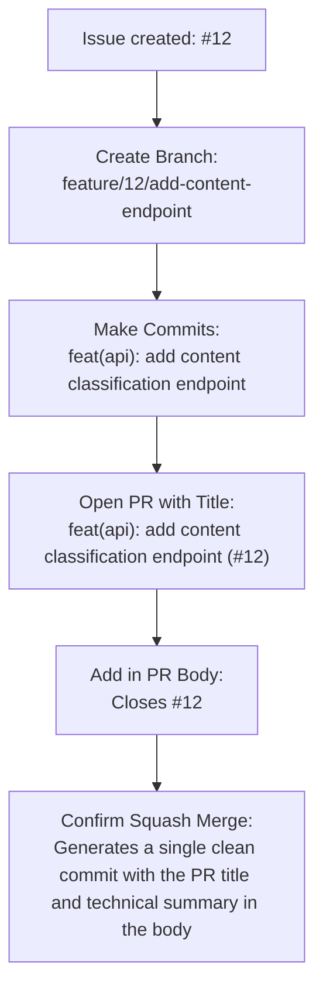

# Pull Requests & Squash Merge

Este documento describe las directrices para la apertura e integración de Pull Requests (PRs) utilizando la estrategia de **Squash Merge** en el proyecto **TechKnowledge API**.

---

## General Pull Request Guidelines

Todo Pull Request creado en el repositorio debe respetar las siguientes reglas:

1. **Target Branch**: Debe abrirse contra la rama `develop`, excepto los hotfixes que deben abrirse contra `main`.
2. **Standardized Title**: Sigue la especificación de Conventional Commits incluyendo el número de la Issue principal al final (detallado abajo).
3. **Clear Scope**: El cuerpo del PR debe describir de forma simple qué se modificó y el impacto de esos cambios.
4. **Test Instructions**: Incluye instrucciones paso a paso sobre cómo validar tu implementación.
5. **Issue Linking**: Asocia la Issue correspondiente usando palabras clave de cierre (ej: `Closes #12`).
6. **Controlled Size**: Evita abrir PRs gigantescos. Los PRs más pequeños facilitan la revisión de código, evitan cuellos de botella y reducen la posibilidad de que bugs pasen desapercibidos.
7. **Mandatory Reviews**: Espera la aprobación de al menos un revisor del equipo antes de hacer el merge.
8. **Language**: Los Pull Requests deben escribirse preferentemente en español (neutral).

---

## PR Title & Squash Merge Title Standard

El título del Pull Request y el título final del Squash Merge deben seguir estrictamente el siguiente formato:

```bash
<type>(<scope>): <description> (#<issue-number>)
```

> [!IMPORTANT]
> - **Main Issue Number**: El número al final debe ser exclusivamente el número de la **Issue principal**.
> - **Do not include the PR number** in the final commit title.
> - **Avoid duplicate titles** containing both the issue and the PR, such as:
>   `docs(patterns): add development guidelines (#1) (#6)`
>   (In this case, `#1` is the Issue and `#6` is the PR. Keep only the Issue number).

### Correct Title Examples

```bash
docs(patterns): add development guidelines (#1)
feat(api): add content classification endpoint (#12)
fix(validation): fix negative consumption validation (#18)
```

---

## Recommended PR Template

Al abrir el PR, copia y completa la siguiente plantilla en el campo de descripción:

```markdown
## What was done

- [Describe the change or new feature objectively]
- [Add relevant technical details if necessary]

## How to test

1. Start the application locally
2. Run the command: [insert test command, e.g., pytest / npm test]
3. Send a test request to the modified endpoint (e.g., via Postman or Swagger)

## Related Issue

Closes #[Issue Number]
```

---

## Squash Merge Integration

El proyecto utiliza la estrategia de **Squash Merge** por defecto para fusionar los Pull Requests.

### What is Squash Merge?
Es la técnica donde todos los commits intermedios realizados en una rama de funcionalidad se agrupan y compactan en un **único commit limpio** al integrarse en la rama principal (`develop` o `main`).

### Benefits
- Mantiene el historial de Git limpio y lineal.
- Facilita revertir cambios completos si es necesario.
- Elimina commits de progreso intermedios (como "fix typo", "wip", "test") del historial de la rama de destino.

### Squash Merge Rules

- **Final Commit Title**: El título final del commit squash en GitHub debe seguir el formato Conventional Commits con el número de la Issue principal al final (idéntico al título del PR).
- **Commit Body (Extended Description)**: En el Squash Merge, el campo *Extended description* del formulario de GitHub se convierte en el cuerpo del commit final.
  - La descripción **no debe ser obligatoriamente la lista automática de commits** generada por GitHub.
  - La recomendación del proyecto es usar este campo para hacer un **resumen técnico** de las entregas del PR y mantener la referencia de cierre de la Issue (`Closes #issue`).
  - También es aceptable mantener la lista de commits en la descripción si están muy bien redactados y son útiles para entender la entrega. Sin embargo, para mantener el historial de Git limpio, da preferencia al formato de *resumen técnico + Closes #issue*.

**Ejemplo recomendado de Extended Description:**

```text
- Add Git workflow documentation
- Define branch naming convention
- Define commit convention
- Define Pull Request guidelines
- Add Squash Merge instructions

Closes #1
```

- **Review before confirming**: Antes de hacer clic en confirmar el merge, revisa siempre la caja de texto del título y la descripción del commit generadas automáticamente por GitHub. Ajusta al estándar y elimina cualquier commit intermedio o título duplicado innecesario.

---

## Complete Flow: Branch, PR & Squash Merge

Para garantizar el éxito del proceso, sigue este ejemplo de flujo completo e integrado:


